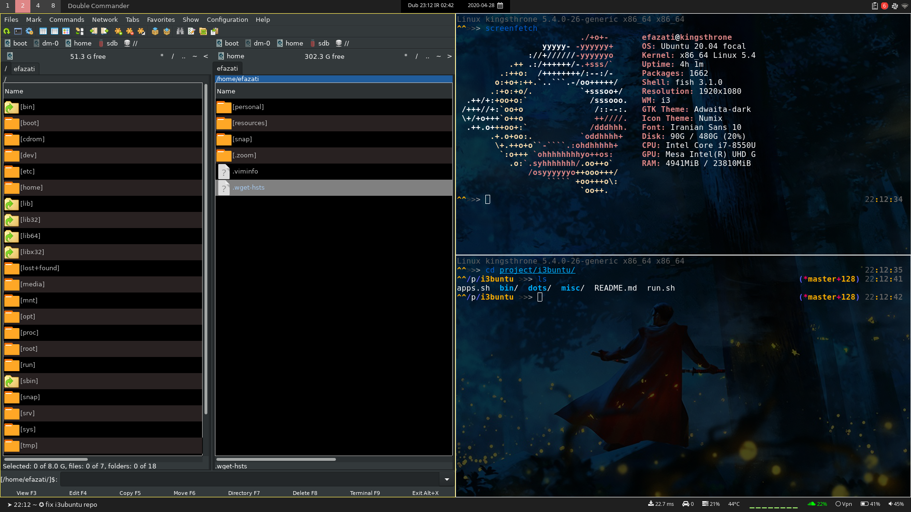

i3buntu
============

In this project you can install i3 from i3 without installing anything that you don't need

> Still Under development 
For using these type of projects, you should know linux and bash enough to edit them based on your needs.




# Requirements
* Ubuntu server 20.04
* An internet connection.

# Default Ubuntu packages
The standard Ubuntu distribution comes preinstalled with a number of standard packages. This project tries to determine what packages allow for the desired Ubuntu setup to be made. As of this writing (July 15, 2016) the most recent version of Ubuntu is Ubuntu 16.04, and a complete list of all preinstalled packages is to be found in the following manifest file: http://releases.ubuntu.com/xenial/ubuntu-16.04-desktop-amd64.manifest.

# Installation

##### 1. Download and install Ubuntu Server

Go to the website and download ubuntu server 20.04 https://ubuntu.com/ then install it


##### 2. Download and prepare the i3buntu installation files

clone project 

##### 3. Install i3buntu

Now type the following in the terminal:
```
cd i3buntu
sudo chmod +x run.sh
sudo ./run.sh
```
# Todo
- [ ] BUG: Ethernet network not showing on Network Manager but still working
- [ ] Secret folder to save ssh key, AWS key and so on
- [ ] Seperate custom apps from the core
- [ ] Organize the core
- [ ] Common hosts shortkey for ssh 
- [ ] ... 
